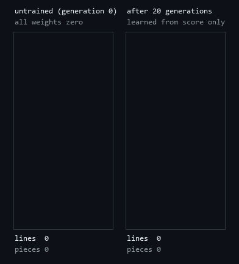
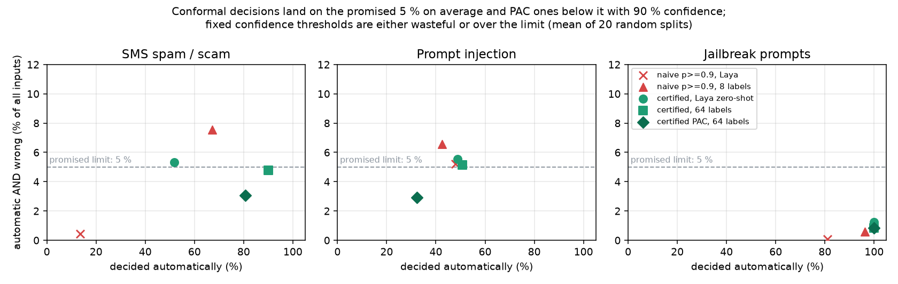
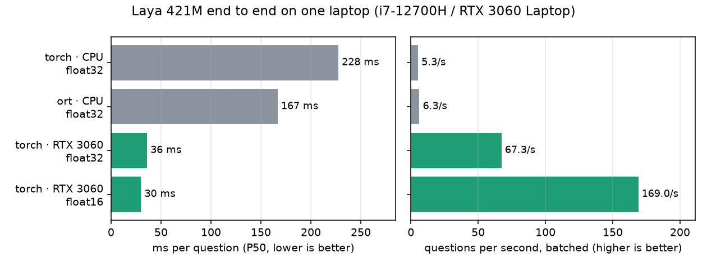
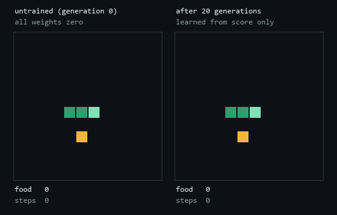
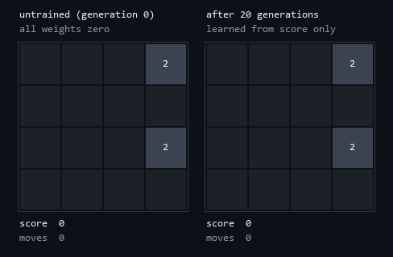
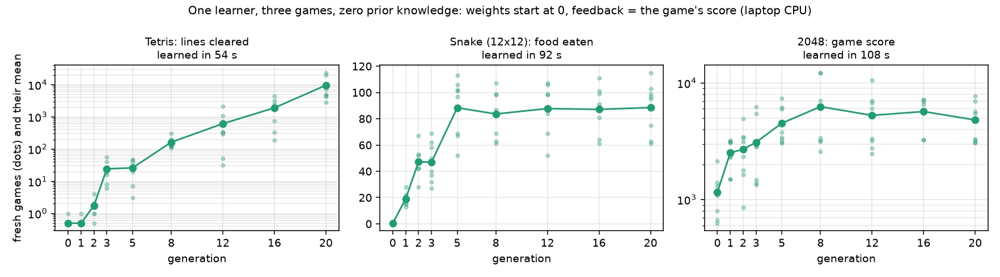
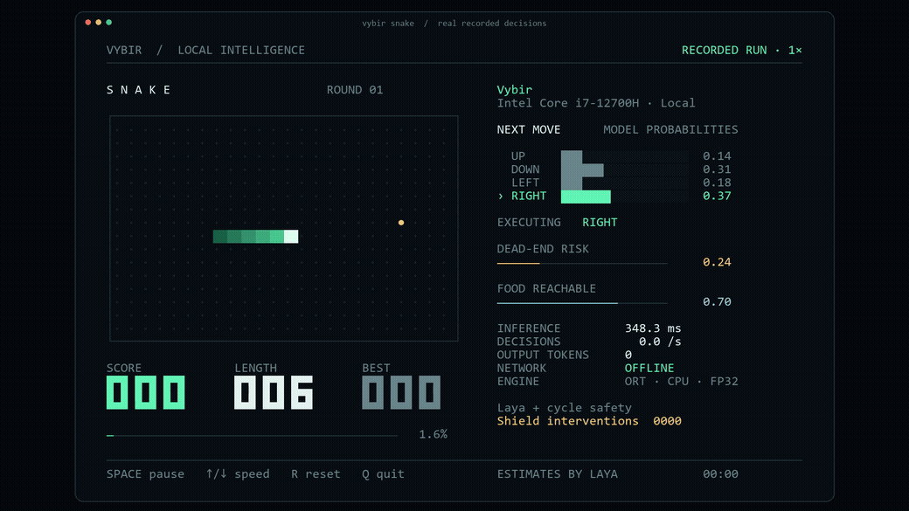

# vybir

**Local AI that decides — and knows when it doesn't.**

[](https://github.com/Galactic717/vybir/actions/workflows/ci.yml)
[](LICENSE)


vybir runs the [Laya](https://github.com/NandhaKishorM/laya) typed-decision models on any PC
(Windows, Linux or macOS, CPU or NVIDIA GPU) and adds what a model that decides for people
needs: a **statistical guarantee on how often it is wrong**, and the honesty to **hand a case
to a human when it is not sure**. It also ships a tiny learner that **teaches itself Tetris,
Snake and 2048 from nothing but the score**.

<p align="center">
  
</p>
<p align="center"><sub>Same pieces, same code. Left: all weights zero. Right: after 54 s of self-play on a laptop CPU. Nobody told it a single Tetris rule of thumb.</sub></p>

## Why

Software constantly needs *decisions*, not text: which team gets this ticket, is this SMS a
scam, is this prompt an attack on my chatbot. The usual answer is a chat model and "reply in
JSON" — slow, paid per call, online, and it never says "I'm not sure".

Laya answers typed questions (`choice`, `score`, `noul` = probability of true) in **one
forward pass with zero generated tokens**. vybir makes that run everywhere and makes it
trustworthy:

| | |
|---|---|
| **Any PC** | Windows / Linux / macOS, CPU or CUDA, PyTorch or ONNX Runtime. |
| **Fast** | **30 ms** per decision on an RTX 3060 *Laptop* GPU (169 decisions/s batched); 167 ms on a laptop CPU. |
| **Faithful** | Encoder output **bit-identical** to the Hugging Face ModernBERT reference on the real weights. 183 tests. |
| **Certified** | Split-conformal guarantee: **P(decided automatically AND wrong) ≤ α**; everything else is deferred. PAC and per-class variants. |
| **Few-shot** | A 1,026-parameter adapter learns from a handful of your labels in about a second on a CPU. |
| **Self-learning agents** | One learner, three games, zero prior knowledge, minutes on a laptop CPU. |

## Install

```bash
git clone https://github.com/Galactic717/vybir
cd vybir
pip install -e ".[demo]"          # add ,ort for ONNX Runtime and ,server for the HTTP API
```

For an NVIDIA GPU install a CUDA build of PyTorch first (it can live in its own virtual
environment so other projects keep their CPU torch):

```bash
pip install torch --index-url https://download.pytorch.org/whl/cu126
```

The first model load downloads `convaiinnovations/laya` (~800 MB) into the Hugging Face cache;
after that everything runs offline. The arcade needs no model download at all.

## Quick start

```python
import vybir

agent = vybir.load("convaiinnovations/laya")          # GPU + float16 if present, else CPU
result = agent.predict(
    "I was billed twice. Please refund the duplicate.",
    {
        "department": {"type": "choice", "instructions": "Who should handle this?",
                       "criteria": ["billing", "technical", "sales"]},
        "urgency": {"type": "score", "instructions": "How urgent is this?",
                    "criteria": ["not urgent", "soon", "critical"]},
        "refund": {"type": "noul", "instructions": "Does the customer ask for money back?"},
    },
)
print(result["answers"])   # billing 0.89 · urgency 1.32 on 0..2 · refund P(true) 0.84
```

```bash
vybir predict --state-file examples/state.json --questions examples/questions.json
vybir route --state "Mein Konto wurde zweimal belastet"   # which checkpoint, and why
vybir bench                                               # speed on your machine
```

## Certified decisions

A confidence of 0.99 is a number, not a promise. `vybir certify` turns a few hundred labelled
examples into one:

```bash
vybir certify --data sms.jsonl --question examples/scam_question.json --alpha 0.05 --per-class --out cert.npz
vybir decide --cert cert.npz --state "URGENT! Your bank card has been blocked. Confirm your PIN at http://secure-bank-verify.co to restore access"
```

```json
{
  "label": "legitimate",
  "probabilities": {"legitimate": 0.9927, "spam": 0.0073},
  "prediction_set": ["legitimate", "spam"],
  "automatic": false,
  "guarantee": "for every true label: P(automatic and wrong) <= 0.05"
}
```

`sms.jsonl` holds one `{"text": "...", "label": "spam"}` per line (here: 800 messages from the
public SMS Spam Collection); `certify` keeps 20 % aside and reports how the promise held on
them. That is real output, and an honest one. The certifier was calibrated on the 2012 SMS Spam
Collection, which contains almost no bank phishing, so the model itself is fooled (p = 0.99
"legitimate"). The per-class guarantee still refuses to decide and defers the message to a
human. An ordinary text (`"running 10 min late, save me a seat"`) is decided automatically.

How it works: a residual adapter on the hidden state of each answer option (it starts exactly
at zero-shot Laya), then split conformal prediction. vybir acts when the prediction set holds
at most one answer, so a wrong automatic decision always means a miss that the α budget
already counts. Details, the protocol and every negative result:
[docs/CERTIFIED_DECISIONS.md](docs/CERTIFIED_DECISIONS.md).

### Results on public data

Three public datasets, 20 random splits each, α = 5 %, 200 calibration examples:

<p align="center"></p>

| | Laya, 0 labels | vybir adapter, 64 labels | TF-IDF baseline, 64 labels |
|---|---:|---:|---:|
| **Jailbreak prompts** (1,306): accuracy | **98.8 %** | 99.2 % | 84.1 % |
| decided automatically at α = 5 % (wrong and automatic) | **100 %** (1.25 %) | 100 % (0.84 %) | 77.8 % (4.46 %) |
| **Prompt injection** (662): accuracy | 76.0 % | 78.6 % | 67.1 % |
| **SMS spam** (5,574): accuracy | 76.6 % | 91.0 % | 86.6 % |

The finding that matters most for safety filters: a guarantee on *all* traffic is not
enough. At "≤ 5 % of all messages wrong", **23.8 % of the spam still went through
automatically**; with `--per-class` it was **3.5 %**. For prompt injections: 14.0 % → 5.05 %.

## Speed

<p align="center"></p>

Laptop: Intel Core i7-12700H, NVIDIA RTX 3060 Laptop 6 GB, Windows 11, torch 2.13. One
e-mail and one four-option question end to end, model loading excluded; `vybir bench`
reproduces it. float16 answers match float32 to about three decimals. On the CPU, INT8 and
P-core-only threading were measured and rejected (both slower; see
[docs/PORTING_NOTES.md](docs/PORTING_NOTES.md)).

## vybir arcade: agents that teach themselves

The same question — *which of my options is best?* — can be learned instead of asked. For
every move a game can make, it reports measurements of the position that move leads to
(heights and holes in Tetris, reachable space in Snake, empty cells in 2048). The brain is
one weight per measurement, **all starting at zero**. The cross-entropy method (a population
of brains; the best scorers become the parents of the next generation) learns the weights
from the game's own score. No rules of thumb, no human games, no hint about which
measurement is good or bad.

<p align="center">
  
  
</p>

<p align="center"></p>

| Game (measurements it sees) | Blind brain (generation 0) | After 20 generations | Learning time |
|---|---:|---:|---:|
| Tetris 10×20 (33) | 0.1 lines | **9,575 lines** (median 5,952) | 54 s |
| Snake 12×12 (6) | 0 food | **88.5 food** of 141 possible (median 96) | 92 s |
| 2048 (7) | score 1,155, best tile 64–256 | score 4,811, best tile 256–512 | 108 s |

Mean of 8 fresh games per cell with no step limit, on the laptop CPU (18 processes);
[`scripts/research_arcade.py`](scripts/research_arcade.py) re-scores every generation.
2048 is where a linear brain on seven measurements tops out: about 4× a blind player, a
1,024 tile in 2 of 8 games at generation 8, never the 2,048 tile, and the last generation is
not the best one. Snake plateaus after generation 5.

```bash
vybir arcade watch tetris                 # the shipped brain, live in your terminal
vybir arcade watch snake --generation 0   # the same brain before it learned anything
vybir arcade train 2048                   # learn your own from zero
vybir arcade record snake --out snake.gif
```

Honest scale: hand-tuned and heavily optimised game agents score far higher than these; the
point is learning from nothing, on a laptop, in minutes, with every step visible.

## Decisions in a loop: Laya plays Snake

<p align="center"></p>

A different demo: here nothing is learned. Every move asks Laya three typed questions (which
direction, is a safe route available, is the food reachable) about a planner's description of
each move, and a deterministic Hamiltonian-cycle shield may overrule unsafe proposals (shown
on screen). It shows typed decisions driving a live loop; `vybir snake` runs it in your
terminal. The GIF is a real recording at original speed on the laptop CPU.

## More

- **CLI:** `predict`, `route`, `bench`, `export-onnx`, `serve` (HTTP `/predict /route
  /health`), `certify`, `decide`, `snake`, `arcade`. `vybir <command> --help` for options.
- **Checkpoints:** English (421M), multilingual (322M, `subfolder="multilingual"`),
  typed-decisions (421M). `vybir.Router()` picks one per request from the script and language.
- **ONNX Runtime:** `vybir export-onnx` once, then `backend="ort"`: 1.36× faster on a CPU,
  184/184 identical decisions. With `onnxruntime-gpu`/`-directml` it uses the GPU provider
  (implemented, not yet measured).
- **Presets and shortlist:** `triage_questions`, `email_questions`, `guard_questions`,
  `moderation_questions`, `router_questions`; `predict_shortlist` for choices with hundreds of
  labels.
- **How the port was verified, and the defects found on the way:**
  [docs/PORTING_NOTES.md](docs/PORTING_NOTES.md).

## Reproduce everything

```bash
pip install -e ".[ort,demo,server,dev,research]"
pytest -q                                   # unit + parity tests (real-checkpoint ones run if cached)
python scripts/research_certify.py extract  # Laya features for the three datasets
python scripts/research_certify.py run      # 20 splits -> research/results.json, summary.md
python scripts/figures.py                   # README figures
vybir arcade train tetris                   # and snake, 2048
python scripts/research_arcade.py           # score every generation on fresh games
```

## Limitations

- The guarantees assume new inputs look like the calibration data. Under distribution shift
  they can fail; the phishing example above shows the model itself being fooled.
- The plain guarantee holds on average over calibration sets; use `delta=` (PAC) for a
  guarantee on your particular calibration set.
- With 8–32 labels the adapter can rank slightly worse than zero-shot Laya; on lexical tasks
  with many labels a TF-IDF model can rank better (numbers in the research doc).
- Laya's English checkpoint reads English; other languages need the multilingual one.
  Confidence is not accuracy, and the weights are Convai's: vybir does inference and
  adaptation, not pre-training.

## Credits and license

Apache-2.0 — see [LICENSE](LICENSE) and [NOTICE](NOTICE). Laya and its weights are by Convai
Innovations and contributors ([NandhaKishorM/laya](https://github.com/NandhaKishorM/laya)).
Runtime structure, the Laya Snake demo and part of the test suite are adapted from
[mizorewww/laya-mlx](https://github.com/mizorewww/laya-mlx). vybir is an independent project,
not an official Convai Innovations release.
